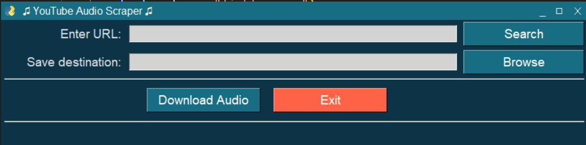

# YouTube Audio Scraper

**YouTube Audio Scraper** is a Python application that allows you to easily download audio from YouTube videos. With a simple and user-friendly interface, you can quickly extract audio tracks from your favorite videos and save them to your local machine.

## Features

- Download audio from YouTube videos as MP3 files.
- Specify the save destination for downloaded audio.
- User-friendly graphical interface built with PySimpleGUI.
- Dark theme for comfortable usage, especially in low-light conditions.
- Direct access to the YouTube website from the app.

## Installation

Before running the application, make sure you have Python installed on your system. You can download Python from the official website: [Python.org](https://www.python.org/downloads/).

1. Clone this repository to your local machine:
```shell
git clone https://github.com/RDC23/YouTubeAudioDownloader
```

3. Install the required Python packages:
```python
pip install PySimpleGUI pytube
```

## Usage

1. Run the application by executing `audioscraper.py`:
```python
python audioscraper.py
```


2. In the application window, enter the URL of the YouTube video you want to download audio from.

3. Specify the destination folder where you want to save the audio file by clicking the "Browse" button next to "Save destination."

4. Click the "Download Audio" button to start the download process.

5. You can also open the YouTube website in a new window by clicking the "Search YouTube" button.

## GUI Window


## Acknowledgments

- [PySimpleGUI](https://pysimplegui.readthedocs.io/en/latest/) for providing a simple GUI framework.
- [pytube](https://github.com/pytube/pytube) for enabling YouTube video processing.
  
